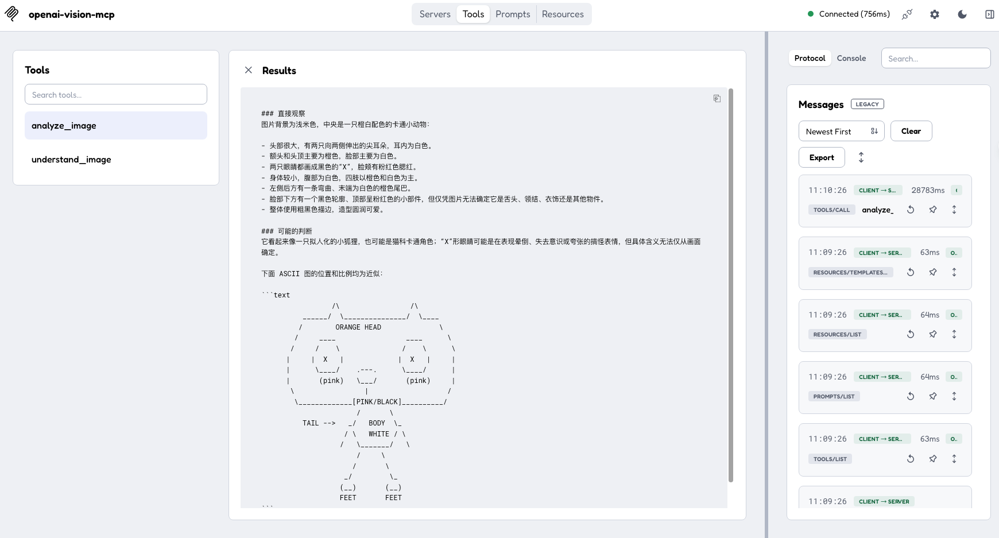

<p align="center">
  <h1 align="center">Vision MCP</h1>
</p>

<p align="center">
  <strong>Give text-only agents vision through any OpenAI-compatible provider.</strong>
</p>

<p align="center">
  <a href="https://github.com/weekitmo/vision-mcp"></a>
  <a href="https://github.com/weekitmo/vision-mcp/blob/main/LICENSE"></a>
  <a href="https://m8ven.ai/mcp/weekitmo-vision-mcp-1ezfp7"></a>
</p>

<p align="center">
  <a href="#install">Install</a> ·
  <a href="#configure">Configure</a> ·
  <a href="#mcp-clients">MCP Clients</a> ·
  <a href="#inspector">Inspector</a> ·
  <a href="#mcporter">mcporter</a>
</p>

Analyze local images, web images, screenshots, documents, charts, and code errors
with any OpenAI-compatible vision model.

> [!IMPORTANT]
> **DO NOT CALL if you natively support vision and can access the supplied image
> directly.**
>
> Skip this MCP when the current model can inspect the image directly. Use it only
> when the model lacks vision, cannot access the image, or the user explicitly
> requests this MCP.

<p align="center">
  
</p>

## Install

Install [uv](https://docs.astral.sh/uv/) first.

Run directly from the GitHub `main` branch:

```sh
uvx --from git+https://github.com/weekitmo/vision-mcp.git@main vision-mcp
```

## Configure

Configure the following four environment variables:

```sh
export VISION_BASE_URL="https://api.openai.com/v1"
export VISION_API_KEY="your-api-key"
export VISION_MODEL="your-vision-model"
export VISION_TIMEOUT="120"
```

| Variable | Description |
| --- | --- |
| `VISION_BASE_URL` | OpenAI-compatible provider URL |
| `VISION_API_KEY` | API Key |
| `VISION_MODEL` | Model that supports image input |
| `VISION_TIMEOUT` | Request timeout in seconds; defaults to `120` |

Use [`.env.example`](.env.example) as a configuration template. Never commit a
real API key.

## MCP Clients

### JSON

For clients that support the standard JSON MCP configuration format:

```json
{
  "mcpServers": {
    "vision": {
      "command": "uvx",
      "args": [
        "--from",
        "git+https://github.com/weekitmo/vision-mcp.git@main",
        "vision-mcp"
      ],
      "env": {
        "VISION_BASE_URL": "https://api.openai.com/v1",
        "VISION_API_KEY": "your-api-key",
        "VISION_MODEL": "your-vision-model",
        "VISION_TIMEOUT": "120"
      }
    }
  }
}
```

### Codex

Add the following to `~/.codex/config.toml` or `.codex/config.toml` in a
trusted project:

```toml
[mcp_servers.vision]
command = "uvx"
args = [
  "--from",
  "git+https://github.com/weekitmo/vision-mcp.git@main",
  "vision-mcp",
]
env_vars = [
  "VISION_BASE_URL",
  "VISION_API_KEY",
  "VISION_MODEL",
  "VISION_TIMEOUT",
]
startup_timeout_sec = 60
tool_timeout_sec = 180
```

The `env_vars` list declares which variables Codex should forward to Vision MCP;
it does not contain their values. Configure the upstream vision provider in the
same terminal before starting Codex:

```sh
export VISION_BASE_URL="https://api.openai.com/v1"
export VISION_API_KEY="your-api-key"
export VISION_MODEL="your-vision-model"
export VISION_TIMEOUT="120"
```

These settings configure the provider used by Vision MCP. They are independent
of the account or API key used by Codex itself. After exporting the variables,
start Codex or verify that the MCP server is registered:

```sh
codex mcp list
```

See [`config/codex.toml.example`](config/codex.toml.example) for the complete
example.

### Grok

Add the following to `~/.grok/config.toml` or the project's
`.grok/config.toml`:

```toml
[mcp_servers.vision]
command = "uvx"
args = [
  "--from",
  "git+https://github.com/weekitmo/vision-mcp.git@main",
  "vision-mcp",
]
enabled = true
startup_timeout_sec = 60
tool_timeout_sec = 180

[mcp_servers.vision.env]
VISION_BASE_URL = "https://api.openai.com/v1"
VISION_API_KEY = "your-api-key"
VISION_MODEL = "your-vision-model"
VISION_TIMEOUT = "120"
```

Grok does not use Codex's `env_vars` list. It uses
`[mcp_servers.vision.env]` to configure the MCP process environment directly.
The expected variable name is `VISION_BASE_URL`, not `VISION_API_BASE_URL`.

To avoid storing the API key directly in TOML, reference environment variables
that are available when Grok starts:

```toml
[mcp_servers.vision.env]
VISION_BASE_URL = "${VISION_BASE_URL}"
VISION_API_KEY = "${VISION_API_KEY}"
VISION_MODEL = "${VISION_MODEL}"
VISION_TIMEOUT = "${VISION_TIMEOUT:-120}"
```

These settings configure the provider used by Vision MCP. They are independent
of the account or API key used by Grok itself. Do not commit a project-level
`.grok/config.toml` that contains a real API key. Verify the configuration with:

```sh
grok mcp list
```

See [`config/grok.toml.example`](config/grok.toml.example) for the complete
example.

## Inspector

Start MCP Inspector with:

```sh
./scripts/test-ui.sh
```

The script pins `@modelcontextprotocol/inspector@2.1.0`.

In Inspector:

1. Open `vision-local`.
2. Enter the four `VISION_*` settings under `Environment Variables`.
3. Connect to the server.
4. Open `Tools`.
5. Select `analyze_image` or `understand_image`.
6. Enter the image path and prompt, then run the tool.

Inspector stores its local configuration in `.inspector/mcp.json`, which is
excluded from Git.

## mcporter

Initialize the project configuration:

```sh
./scripts/setup-mcporter.sh
```

Inspect the available tools:

```sh
mcporter list vision --schema --all-parameters
```

Analyze one image:

```sh
mcporter call vision.analyze_image \
  image=/absolute/path/to/screenshot.png \
  prompt="Extract all text from this image" \
  mode=ocr \
  detail=high \
  --timeout 120000
```

Compare multiple images:

```sh
mcporter call vision.understand_image \
  --args '{
    "images": [
      "/absolute/path/before.png",
      "/absolute/path/after.png"
    ],
    "prompt": "Compare the differences between these images",
    "mode": "compare"
  }' \
  --timeout 120000 \
  --output json
```

Read the built-in documentation resources:

```sh
mcporter resource vision
mcporter resource vision vision://docs/quickstart
mcporter resource vision vision://docs/tools
```

## Tools

### `analyze_image`

Analyze a single image. This tool is suitable for Inspector, mcporter, and
command-line calls.

```text
image       Local path, HTTP(S) URL, or data URL
prompt      Question or instruction for the model
mode        Analysis mode
ascii_mode  Whether to represent layouts with ASCII
detail      Image input detail level
max_tokens  Maximum output length
```

### `understand_image`

Analyze or compare multiple images. This tool also supports clients that use
different image argument formats.

```text
images      List of images
prompt      Question or instruction for the model
mode        Analysis mode
ascii_mode  Whether to represent layouts with ASCII
detail      Image input detail level
max_tokens  Maximum output length
```

Available modes:

`auto` · `describe` · `ocr` · `document` · `ui` · `chart` · `compare` ·
`spatial` · `code`

PNG, JPEG, WEBP, and GIF are supported. Each call accepts up to 10 images.

## From Source

For development or debugging:

```sh
git clone https://github.com/weekitmo/vision-mcp.git
cd vision-mcp
uv sync --frozen
uv run vision-mcp
```

Run from source in an MCP client:

```json
{
  "mcpServers": {
    "vision": {
      "command": "uv",
      "args": [
        "--directory",
        "/absolute/path/to/vision-mcp",
        "run",
        "--frozen",
        "vision-mcp"
      ],
      "env": {
        "VISION_BASE_URL": "https://api.openai.com/v1",
        "VISION_API_KEY": "your-api-key",
        "VISION_MODEL": "your-vision-model",
        "VISION_TIMEOUT": "120"
      }
    }
  }
}
```

## License

MIT
